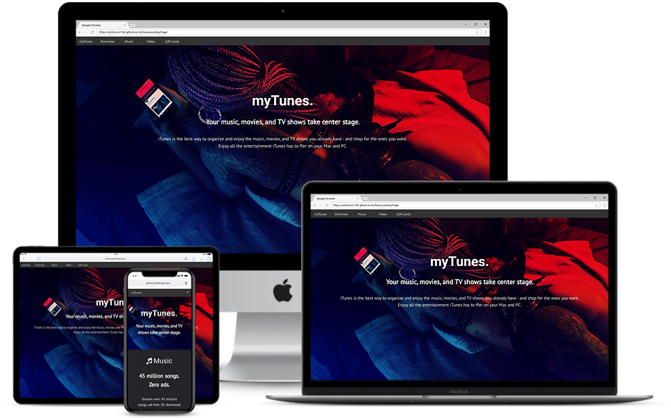
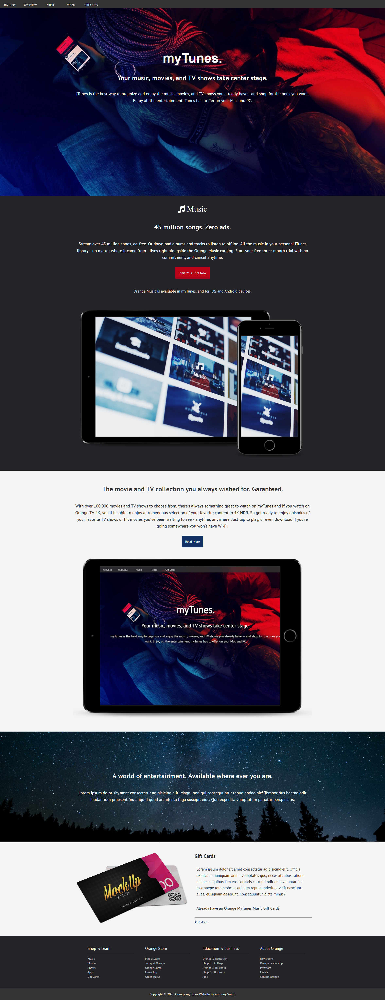

# myTunes Responsive Landing Page
 
 
 Landing page modeled after iTunes page The logic is very simple with the minimum lines of code possible.
 
## Steps to execute this Website
- Download the entire code 
- Open up the index.html.
- [View Live Site](https://anthonys1760.github.io/myTunes-Landing-Page/)

## Technologies used: 
- HTML [Foundation/Structure]
- CSS [Style/Presentation]
- Javascript[Logic/Working of smooth transitions]
- jQuery

